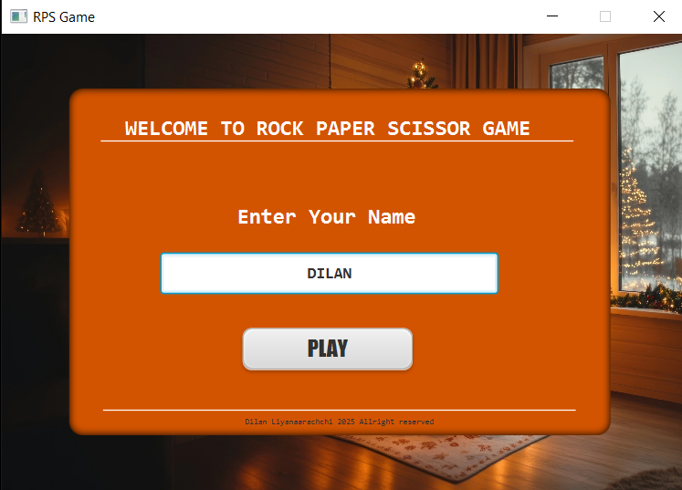
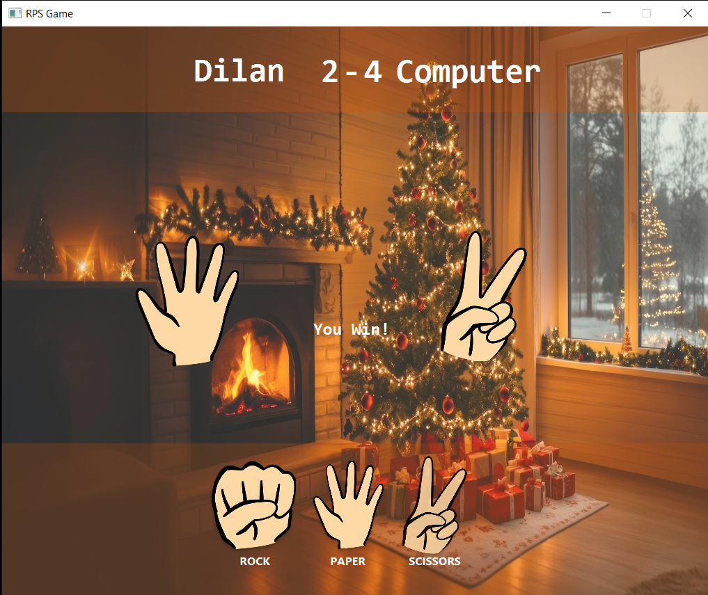

# 🪨📄✂️ Rock Paper Scissors Game (JavaFX)

Welcome to the Rock Paper Scissors (RPS) Game built with **JavaFX**!  
This simple yet interactive desktop game allows users to enter their name and play against the computer.

---

## 🎮 Features

- 🔑 User login (name input)
- 🖼️ Beautiful UI with background image
- 🧠 Computer opponent with randomized choices
- 🏆 Real-time result display (Win / Lose / Draw)
- 🔁 Game reset and replay functionality

---

## 🖥️ Screenshots

### 👋 Login Screen
Enter your name to begin the game.

---

### 🎲 Game Interface
Choose between Rock, Paper, or Scissors. The result will be displayed after both player and computer make their moves.

---

## ⚙️ Technologies Used

- **Java 17+**
- **JavaFX**
- **Scene Builder** (for FXML UI design)
- **Maven** 
---
